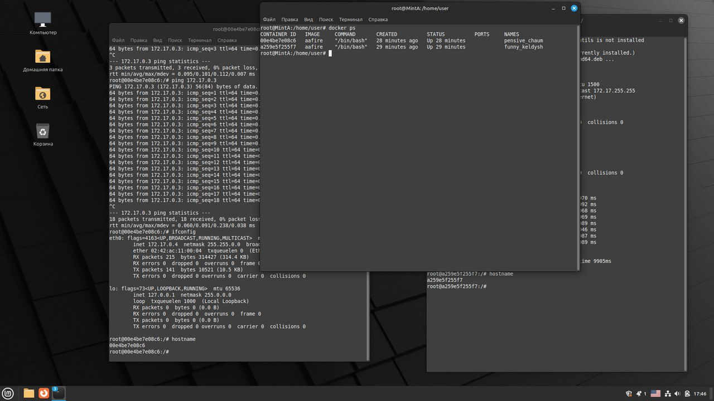

# Лабораторная 4
Я установила приложение aafire в контейнер, введя в Dockerfile команду ```RUN apt-get install -y libaa-bin``` . Командой ```aafire``` в контейнере проверила его работу: <br><br>
 <br><br>
Результат вывода списка работающих контейнеров на машине:
 <br><br>
Подключение контейнеров к созданной сети и результаты команды ```docker network inspect myNetwork```:<br><br>
 <br><br>
Командой ```ping``` проверила связь между контейнерами:<br><br>
 <br><br>
